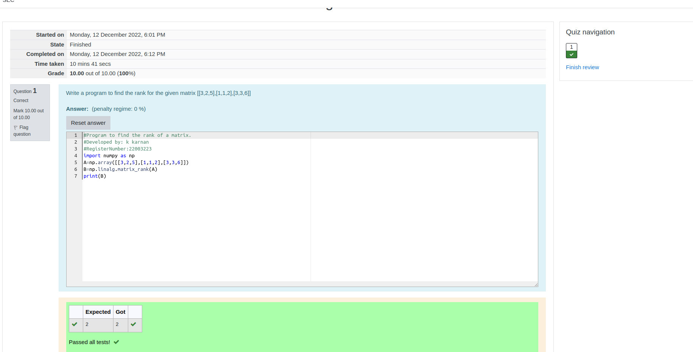

# RANK-OF-A-MATRIX
## Aim:
To write a python program to find the rank of a matrix
## Equipment’s required:
1. 	Hardware – PCs
2. 	Anaconda – Python 3.7 Installation / Moodle-Code Runner
## Algorithm:
### Step 1: import numpy as np
### Step 2: get the input matrix
### Step 3: find the rank of the matrix
### Step 4: print the result
## Program:
```python
#Program to find the rank of a matrix.
#Developed by: k karnan
#RegisterNumber:22003223
import numpy as np
A=np.array([[3,2,5],[1,1,2],[3,3,6]])
B=np.linalg.matrix_rank(A)
print(B)
```
## Output:

## Result:
Thus the rank for the given matrix is successfully solved by  using a python program.

